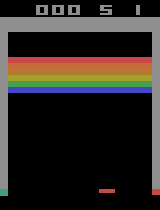
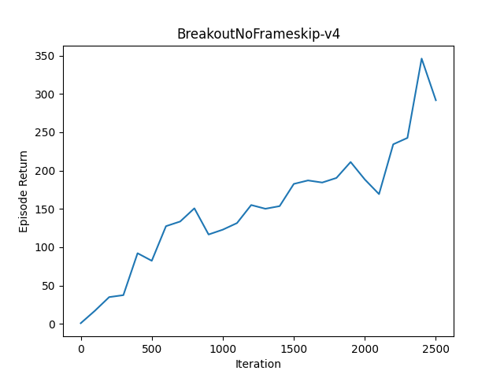

# PPO Atari Implementation

## Description

This repository provides a Proximal Policy Optimization (PPO) algorithm that does not run rollouts in parallel. The Atari implementation of PPO handles a multi-agent rollout with 8 actors, but as the number of agents increases, neural network computation on the CPU and parallel rollout can become slower on a home desktop.

To address this issue, we have aimed to improve training speed by using **Batch Processing** for neural network computations during the rollout, generating actions, and processing them in a **For Loop** while interacting with the environment.

## Installation

Create a virtual environment and install the required dependencies:

```bash
pip install -r requirements.txt
```
We have tested this with Python 3.9.13. We recommend creating a new virtual environment to avoid compatibility issues with other libraries, as the gym Atari environment might not install properly otherwise.

## Usage

To train on the default Atari environment (BreakoutNoFrameskip-v4), run:

```bash
python train.py
```

If you want to train on a different environment, you can specify it using the `--env_name` option:

```bash
python train.py --env_name [ENVIRONMENT_NAME]
```

You can check the environments on the official [OpenAI Gym](https://www.gymlibrary.dev/environments/atari/) page. Please make sure to append `NoFrameskip-v4` to the environment name.

By default, the number of workers is set to 64, but you can change this and other parameters using command-line options. For more details, refer to:

```bash
python train.py -h
```

You can watch the trained model play by running:

```bash
python test.py --env_name [ENVIRONMENT_NAME] --load_weights_folder [WEIGHTS_FOLDER]
```

# Results

<table>
  <tr>
    <th>BreakoutNoFrameskip-v4</th>
    <th>BreakoutNoFrameskip-v4</th>
  </tr>
  <tr>
    <td></td>
    <td></td>
  </tr>
</table>


## References

1. **Schulman, J., Wolski, F., Dhariwal, P., Radford, A., & Klimov, O.** (2017). *Proximal Policy Optimization Algorithms*. arXiv preprint arXiv:1707.06347. [Link to paper](https://arxiv.org/abs/1707.06347)
