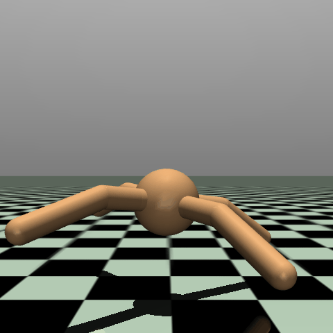
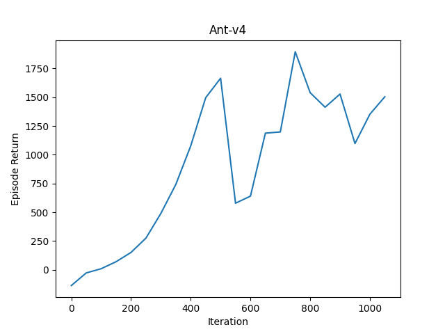
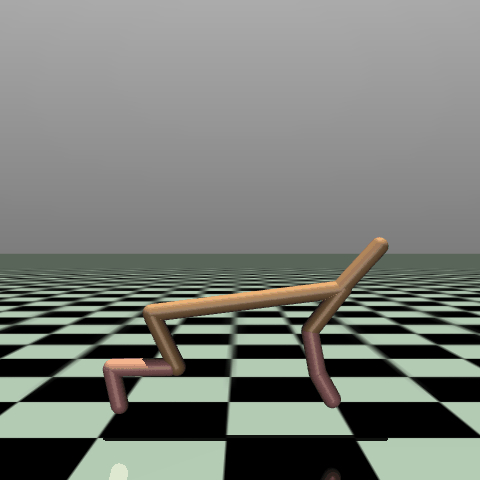
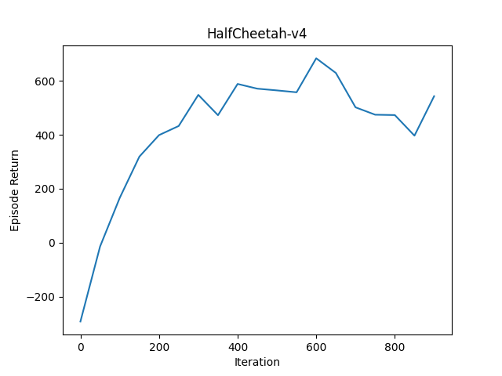
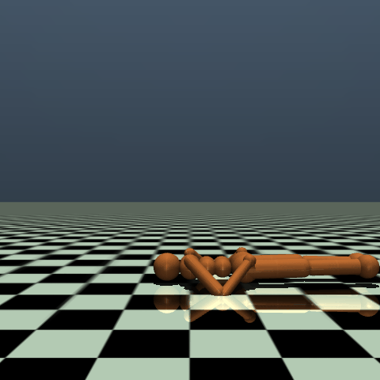
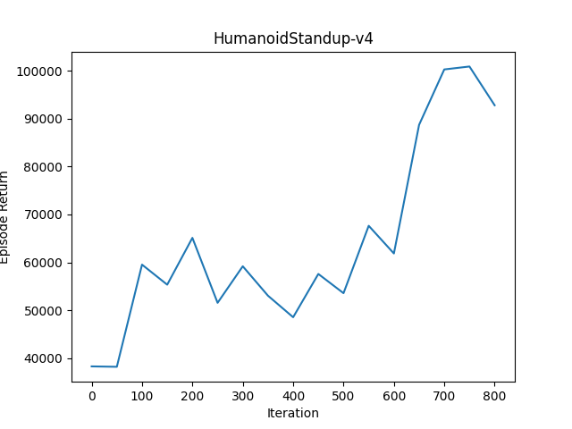
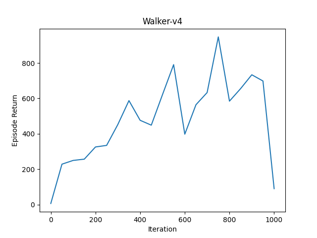

# PPO MuJoCo Implementation
## Description
This repository contains code for training and validation in MuJoCo in PPO.

MuJoCo is a physics engine for fast simulation of robots and other objects.
MuJoCo is characterized not merely by its environment, but also **the action to be input is continuous values.**.
This is more difficult to learn than a neural network structure that simply outputs probabilities and determines discrete value actions.
Here, the policy network is designed to output the mean and variance of continuous-valued actions from the input states.
And then, the continuous value action is determined by sampling from its mean and variance.

Here the variance can take infinite values in the positive direction, which can lead to problems such as gradient explosion. However, placing restrictions on the output of the network will make the score worse. So, since most of MuJoCo's actions take on values of -1~1, Limit toward continuous value actions sampled by the $tanh$ function.
The policy gradient method usually treats $log \pi(a|s)$ as a parameter update, but this part of the equation needs to be changed because of the limitation imposed by the $tanh$ function. The equations for this method are described in the appendix section of the SAC paper.

Note that this code is an implementation and validation of PPO in the continuous value action space, so there is no guarantee that PPO will score well in these environments. In fact, in some MuJoCo environments with Gym Documents, we have confirmed that nan is entered in the output of the action, and although we normalize the input observations, we think there is an implementation problem.

## Usage
### Install
Create a virtual environment and install the required dependencies:
```bash
pip install -r requirements.txt
```

## Training
To run training, execute the following command:
```bash
python train.py --env_name [ENVIRONMENTS_NAME]
```
The `--env_name` specifies the MuJoCO environment in which to run. See [https://www.gymlibrary.dev/environments/mujoco/](https://www.gymlibrary.dev/environments/mujoco/) for the environments that can be used. See `python train.py -h` for other options.

You can watch the learned model play by executing the following command:
```bash
python test.py --env_name [ENVIRONMENTS_NAME] --load_weights_folder [LOAD_WEIGHTS_FOLDER]
```

## Results
<table>
	<tbody>
		<tr>
			<th>Ant-v4</th>
			<th>Ant-v4</th>
		</tr>
		<tr>
			<td></td>
			<td></td>
		</tr>
	</tbody>
</table>

<table>
	<tbody>
		<tr>
			<th>HalfCheetah-v4</th>
			<th>HalfCheetah-v4</th>
		</tr>
		<tr>
			<td></td>
			<td></td>
		</tr>
	</tbody>
</table>

<table>
	<tbody>
		<tr>
			<th>HumanoidStandup-v4</th>
			<th>HumanoidStandup-v4</th>
		</tr>
		<tr>
			<td></td>
			<td></td>
		</tr>
	</tbody>
</table>

<table>
	<tbody>
		<tr>
			<th>Walker-v4</th>
			<th>Walker-v4</th>
		</tr>
		<tr>
			<td></td>
			<td></td>
		</tr>
	</tbody>
</table>
